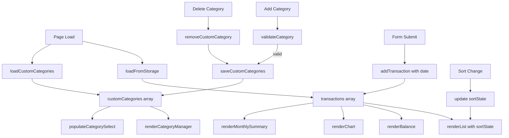

# Design Document: Expense Tracker Enhancements

## Overview

Tiga peningkatan fitur untuk aplikasi Expense Tracker vanilla HTML/CSS/JS yang sudah ada:

1. **Custom Categories** (Req 7) — pengguna dapat membuat dan menghapus kategori sendiri
2. **Monthly Summary View** (Req 8) — ringkasan total pengeluaran per bulan kalender
3. **Sort Transactions** (Req 9) — pengurutan daftar transaksi berdasarkan amount atau category

Semua perubahan mengikuti arsitektur yang sudah ada: tidak ada framework, tidak ada build step, state di `localStorage`, Chart.js via CDN.

## Architecture

Alur data tetap unidirectional seperti sebelumnya:

```
User Action → State Mutation → localStorage Write → Re-render UI
```

Tiga area state baru ditambahkan:

- `customCategories: string[]` — disimpan di localStorage key terpisah
- `transactions[].date: string` — field baru di setiap transaksi (ISO date string)
- `sortState: { key: 'amount'|'category'|null, order: 'asc'|'desc' }` — state in-memory saja, tidak dipersist



## Components and Interfaces

### HTML Structure — Perubahan pada `index.html`

Tiga section baru / modifikasi:

```
<section#category-manager>   — Category_Manager UI (input + list custom categories)
<section#monthly-summary>    — Monthly Summary View
<section#list>               — ditambah sort controls di atas <ul>
```

Urutan section di halaman:
```
<header>
<section#balance>
<section#form>              ← category <select> dipopulasi dinamis
<section#category-manager>  ← baru
<section#list>              ← ditambah sort controls
<section#monthly-summary>   ← baru
<section#chart>
```

### JavaScript — Fungsi Baru / Modifikasi di `js/app.js`

#### Fungsi Baru

| Fungsi | Signature | Tujuan |
|---|---|---|
| `loadCustomCategories` | `() → string[]` | Baca custom categories dari localStorage |
| `saveCustomCategories` | `(cats: string[]) → void` | Tulis custom categories ke localStorage |
| `validateCategory` | `(name: string, existing: string[]) → string\|null` | Validasi nama kategori baru |
| `addCustomCategory` | `(name: string) → void` | Tambah kategori, simpan, re-render |
| `deleteCustomCategory` | `(name: string) → void` | Hapus kategori, simpan, re-render |
| `renderCategoryManager` | `(cats: string[]) → void` | Render daftar custom categories + delete buttons |
| `populateCategorySelect` | `(cats: string[]) → void` | Rebuild `<select#category>` dengan built-in + custom |
| `renderMonthlySummary` | `(transactions: Transaction[]) → void` | Render ringkasan per bulan |
| `getSortedTransactions` | `(transactions: Transaction[], state: SortState) → Transaction[]` | Return sorted copy tanpa mutasi |
| `handleCategoryFormSubmit` | `(event: Event) → void` | Handler submit form category manager |
| `handleCategoryDeleteClick` | `(event: Event) → void` | Delegated handler delete category |
| `handleSortChange` | `(event: Event) → void` | Handler perubahan sort controls |

#### Fungsi yang Dimodifikasi

| Fungsi | Perubahan |
|---|---|
| `addTransaction` | Tambah field `date: new Date().toISOString().slice(0,10)` ke objek transaksi |
| `validateForm` | Validasi category terhadap semua kategori (built-in + custom), bukan hanya VALID_CATEGORIES hardcoded |
| `renderList` | Terima `sortState` dan render hasil `getSortedTransactions` |
| `init` | Load custom categories, render category manager, populate select, render monthly summary, attach sort listeners |

### CSS — Perubahan pada `css/style.css`

- Style untuk `#category-manager`: form input + button inline, list item dengan delete button
- Style untuk `#monthly-summary`: list bulan dengan label + amount
- Style untuk sort controls: row dengan dua `<select>` di atas transaction list
- CSS custom property untuk warna kategori kustom: fallback ke warna default `#94a3b8`

## Data Models

### Transaction (diperbarui)

```js
{
  id: string,        // crypto.randomUUID()
  name: string,      // item name, non-empty
  amount: number,    // positive float
  category: string,  // built-in atau custom category name
  date: string       // "YYYY-MM-DD" — tanggal lokal saat transaksi ditambahkan (BARU)
}
```

Transaksi lama yang tidak memiliki field `date` akan diperlakukan sebagai tanggal tidak diketahui dan tidak muncul di monthly summary (graceful degradation).

### Custom Categories Storage

Key: `"expense-tracker-custom-categories"`  
Value: JSON-serialized `string[]`

```js
// Write
localStorage.setItem("expense-tracker-custom-categories", JSON.stringify(customCategories));

// Read
JSON.parse(localStorage.getItem("expense-tracker-custom-categories") ?? "[]");
```

### Sort State (in-memory only, tidak dipersist)

```js
// SortState shape
{
  key: "amount" | "category" | null,  // null = insertion order (default)
  order: "asc" | "desc"               // default "asc"
}

// Initial state
let sortState = { key: null, order: "asc" };
```

### Built-in Categories

```js
const BUILT_IN_CATEGORIES = ["Food", "Transport", "Fun"];
```

`CATEGORY_COLORS` tetap ada untuk built-in categories. Custom categories mendapat warna fallback `#94a3b8`.

### Validation Rules — Category

| Kondisi | Error |
|---|---|
| Nama kosong atau whitespace-only | "Category name is required." |
| Nama sudah ada (case-insensitive, built-in atau custom) | "Category already exists." |

### Monthly Summary Computation

```js
// Group transactions by "YYYY-MM" key, sum amounts
function computeMonthlySummary(transactions) {
  const map = {};
  transactions.forEach(t => {
    if (!t.date) return; // skip legacy transactions without date
    const key = t.date.slice(0, 7); // "YYYY-MM"
    map[key] = (map[key] || 0) + t.amount;
  });
  // Sort descending by key (most recent first)
  return Object.entries(map)
    .sort(([a], [b]) => b.localeCompare(a))
    .map(([key, total]) => ({ key, total }));
}
```

Format label bulan: `new Date(key + "-01").toLocaleDateString("en-US", { month: "long", year: "numeric" })` → "January 2025"


## Correctness Properties

*A property is a characteristic or behavior that should hold true across all valid executions of a system — essentially, a formal statement about what the system should do. Properties serve as the bridge between human-readable specifications and machine-verifiable correctness guarantees.*

### Property 1: Category add round-trip

*For any* non-empty (after trim) category name that does not already exist, calling `addCustomCategory` should result in that name being present in the array returned by `loadCustomCategories`, and the category `<select>` should contain an option with that value.

**Validates: Requirements 7.2, 7.8**

---

### Property 2: Whitespace category rejection

*For any* string composed entirely of whitespace characters, `validateCategory` should return a non-null error string and `customCategories` in storage should remain unchanged.

**Validates: Requirements 7.3**

---

### Property 3: Duplicate category rejection

*For any* category name that already exists in the combined list of built-in and custom categories (case-insensitive comparison), `validateCategory` should return a non-null error string and no duplicate should be added to storage.

**Validates: Requirements 7.4**

---

### Property 4: Category manager renders all custom categories

*For any* array of custom category names, after `renderCategoryManager` is called, each name should appear in the `#category-manager` section and each should have an associated delete button.

**Validates: Requirements 7.5**

---

### Property 5: Category delete removes from storage and select

*For any* custom category that exists in `customCategories`, calling `deleteCustomCategory` with that name should result in the name no longer being present in `loadCustomCategories()` and no longer appearing as an option in the category `<select>`.

**Validates: Requirements 7.6**

---

### Property 6: Built-in categories invariant

*For any* sequence of `addCustomCategory` and `deleteCustomCategory` operations, the three built-in categories (Food, Transport, Fun) should always remain present in the category `<select>` and should never have a delete button in the Category_Manager.

**Validates: Requirements 7.7**

---

### Property 7: Deleting a category preserves transactions

*For any* set of transactions that reference a custom category, calling `deleteCustomCategory` with that category name should leave the `transactions` array in storage completely unchanged.

**Validates: Requirements 7.9**

---

### Property 8: Monthly summary correctness

*For any* non-empty array of transactions with valid `date` fields, `computeMonthlySummary` should return exactly one entry per distinct calendar month (YYYY-MM), each entry's `total` should equal the sum of `amount` for all transactions in that month, and the entries should be ordered in descending chronological order (most recent first).

**Validates: Requirements 8.1, 8.3**

---

### Property 9: Transaction date recorded and persisted

*For any* transaction added via `addTransaction`, the resulting transaction object in storage should have a `date` field in `"YYYY-MM-DD"` format matching the client's local date at the time of addition.

**Validates: Requirements 8.4**

---

### Property 10: Monthly summary rendering format

*For any* monthly summary entry with key `"YYYY-MM"` and a numeric total, the rendered HTML should contain a month label matching the pattern `"<MonthName> <YYYY>"` (e.g., "January 2025") and the total formatted to exactly two decimal places.

**Validates: Requirements 8.6, 8.7**

---

### Property 11: Sort produces correct order without mutating storage

*For any* array of transactions and any `SortState` with `key` of `"amount"` or `"category"`, `getSortedTransactions` should return a new array (not mutating the original) where:
- if `key = "amount"`: transactions are ordered numerically by `amount` (ascending or descending per `order`)
- if `key = "category"`: transactions are ordered alphabetically by `category` (ascending or descending per `order`)

And the contents of `localStorage` should remain identical before and after the sort.

**Validates: Requirements 9.3, 9.4, 9.5**

---

### Property 12: Stable sort preserves relative order for equal keys

*For any* array of transactions where two or more transactions share the same value for the selected `Sort_Key`, `getSortedTransactions` should preserve the relative insertion order of those equal-key transactions in the output.

**Validates: Requirements 9.8**

---

## Error Handling

| Skenario | Penanganan |
|---|---|
| `localStorage` tidak tersedia saat menyimpan custom categories | `saveCustomCategories` catches error, tampilkan `#storage-warning` |
| `localStorage` berisi JSON tidak valid untuk custom categories | `loadCustomCategories` catches error, return `[]` |
| Category name kosong / whitespace | `validateCategory` return error string, tampilkan di `#category-error` |
| Category name duplikat (case-insensitive) | `validateCategory` return error string, tampilkan di `#category-error` |
| Transaksi lama tanpa field `date` | `computeMonthlySummary` skip transaksi tersebut (graceful degradation) |
| Sort dengan `key = null` | `getSortedTransactions` return copy array tanpa sorting (insertion order) |
| Chart.js CDN gagal load | Tidak berubah dari behavior existing — guard `typeof Chart !== 'undefined'` |

## Testing Strategy

### Pendekatan Dual Testing

Dua jenis test yang saling melengkapi:
- **Unit tests**: contoh spesifik, edge cases, kondisi error
- **Property-based tests**: properti universal di semua input

### Unit Tests (contoh spesifik dan edge cases)

- Category_Manager UI hadir dengan form input dan tombol submit (Req 7.1)
- Sort controls hadir dengan opsi Amount, Category, Asc, Desc (Req 9.1, 9.2)
- Default sort state adalah `null` saat halaman pertama load (Req 9.7)
- Monthly summary menampilkan placeholder saat tidak ada transaksi (Req 8.5)
- `loadCustomCategories` return `[]` saat key tidak ada di storage
- `loadCustomCategories` return `[]` saat nilai di storage adalah JSON tidak valid
- Transaksi lama tanpa `date` tidak muncul di monthly summary

### Property-Based Tests

Gunakan **fast-check** via CDN atau npm. Setiap test dijalankan minimum **100 iterasi**.

Setiap test diberi tag komentar dengan format:
`// Feature: expense-tracker-enhancements, Property N: <property text>`

**Property 1 — Category add round-trip**
```js
// Feature: expense-tracker-enhancements, Property 1: category add round-trip
fc.assert(fc.property(
  fc.string({ minLength: 1 }).filter(s => s.trim().length > 0),
  (name) => {
    // start with empty custom categories
    saveCustomCategories([]);
    addCustomCategory(name.trim());
    const stored = loadCustomCategories();
    return stored.includes(name.trim());
  }
), { numRuns: 100 });
```

**Property 2 — Whitespace category rejection**
```js
// Feature: expense-tracker-enhancements, Property 2: whitespace category rejection
fc.assert(fc.property(
  fc.stringOf(fc.constantFrom(' ', '\t', '\n')),
  (whitespace) => {
    const before = loadCustomCategories();
    const error = validateCategory(whitespace, [...BUILT_IN_CATEGORIES, ...before]);
    return error !== null && JSON.stringify(loadCustomCategories()) === JSON.stringify(before);
  }
), { numRuns: 100 });
```

**Property 3 — Duplicate category rejection**
```js
// Feature: expense-tracker-enhancements, Property 3: duplicate category rejection
fc.assert(fc.property(
  fc.constantFrom(...BUILT_IN_CATEGORIES),
  fc.boolean(),
  (existing, upperCase) => {
    const variant = upperCase ? existing.toUpperCase() : existing.toLowerCase();
    const error = validateCategory(variant, BUILT_IN_CATEGORIES);
    return error !== null;
  }
), { numRuns: 100 });
```

**Property 4 — Category manager renders all custom categories**
```js
// Feature: expense-tracker-enhancements, Property 4: category manager renders all custom categories
fc.assert(fc.property(
  fc.array(fc.string({ minLength: 1 }).filter(s => s.trim().length > 0), { maxLength: 10 }),
  (cats) => {
    const unique = [...new Set(cats.map(c => c.trim()))];
    renderCategoryManager(unique);
    const items = document.querySelectorAll('#category-manager [data-category]');
    return items.length === unique.length &&
      unique.every(c => [...items].some(el => el.dataset.category === c));
  }
), { numRuns: 100 });
```

**Property 5 — Category delete removes from storage and select**
```js
// Feature: expense-tracker-enhancements, Property 5: category delete removes from storage and select
fc.assert(fc.property(
  fc.array(fc.string({ minLength: 1 }).filter(s => s.trim().length > 0), { minLength: 1, maxLength: 5 }),
  (cats) => {
    const unique = [...new Set(cats.map(c => c.trim()))];
    saveCustomCategories(unique);
    const target = unique[0];
    deleteCustomCategory(target);
    return !loadCustomCategories().includes(target);
  }
), { numRuns: 100 });
```

**Property 6 — Built-in categories invariant**
```js
// Feature: expense-tracker-enhancements, Property 6: built-in categories invariant
fc.assert(fc.property(
  fc.array(fc.string({ minLength: 1 }).filter(s => s.trim().length > 0), { maxLength: 5 }),
  (cats) => {
    saveCustomCategories([]);
    cats.forEach(c => { try { addCustomCategory(c.trim()); } catch {} });
    const select = document.getElementById('category');
    const options = [...select.options].map(o => o.value);
    return BUILT_IN_CATEGORIES.every(b => options.includes(b));
  }
), { numRuns: 100 });
```

**Property 7 — Deleting a category preserves transactions**
```js
// Feature: expense-tracker-enhancements, Property 7: deleting a category preserves transactions
fc.assert(fc.property(
  fc.array(transactionArbitrary, { minLength: 1 }),
  fc.string({ minLength: 1 }).filter(s => s.trim().length > 0),
  (txns, catName) => {
    saveToStorage(txns);
    saveCustomCategories([catName.trim()]);
    deleteCustomCategory(catName.trim());
    return JSON.stringify(loadFromStorage()) === JSON.stringify(txns);
  }
), { numRuns: 100 });
```

**Property 8 — Monthly summary correctness**
```js
// Feature: expense-tracker-enhancements, Property 8: monthly summary correctness
fc.assert(fc.property(
  fc.array(transactionWithDateArbitrary, { minLength: 1 }),
  (txns) => {
    const summary = computeMonthlySummary(txns);
    // One entry per distinct month
    const months = txns.map(t => t.date.slice(0, 7));
    const distinctMonths = [...new Set(months)];
    if (summary.length !== distinctMonths.length) return false;
    // Correct sums
    for (const entry of summary) {
      const expected = txns.filter(t => t.date.slice(0,7) === entry.key)
                           .reduce((s, t) => s + t.amount, 0);
      if (Math.abs(entry.total - expected) > 0.0001) return false;
    }
    // Descending order
    for (let i = 1; i < summary.length; i++) {
      if (summary[i-1].key < summary[i].key) return false;
    }
    return true;
  }
), { numRuns: 100 });
```

**Property 9 — Transaction date recorded and persisted**
```js
// Feature: expense-tracker-enhancements, Property 9: transaction date recorded and persisted
fc.assert(fc.property(
  fc.string({ minLength: 1 }).filter(s => s.trim().length > 0),
  fc.float({ min: 0.01, max: 10000 }),
  fc.constantFrom(...BUILT_IN_CATEGORIES),
  (name, amount, category) => {
    const today = new Date().toISOString().slice(0, 10);
    addTransaction(name.trim(), amount, category);
    const stored = loadFromStorage();
    const added = stored[stored.length - 1];
    return added.date === today;
  }
), { numRuns: 100 });
```

**Property 10 — Monthly summary rendering format**
```js
// Feature: expense-tracker-enhancements, Property 10: monthly summary rendering format
fc.assert(fc.property(
  fc.integer({ min: 2000, max: 2099 }),
  fc.integer({ min: 1, max: 12 }),
  fc.float({ min: 0.01, max: 99999 }),
  (year, month, total) => {
    const key = `${year}-${String(month).padStart(2,'0')}`;
    const rendered = formatMonthlySummaryEntry(key, total);
    const monthName = new Date(`${key}-01`).toLocaleDateString('en-US', { month: 'long', year: 'numeric' });
    return rendered.includes(monthName) && rendered.includes(total.toFixed(2));
  }
), { numRuns: 100 });
```

**Property 11 — Sort produces correct order without mutating storage**
```js
// Feature: expense-tracker-enhancements, Property 11: sort produces correct order without mutating storage
fc.assert(fc.property(
  fc.array(transactionArbitrary, { minLength: 2 }),
  fc.constantFrom('amount', 'category'),
  fc.constantFrom('asc', 'desc'),
  (txns, key, order) => {
    saveToStorage(txns);
    const sorted = getSortedTransactions(txns, { key, order });
    // Storage unchanged
    if (JSON.stringify(loadFromStorage()) !== JSON.stringify(txns)) return false;
    // Original array unchanged
    if (JSON.stringify(txns) !== JSON.stringify(txns)) return false;
    // Correct order
    for (let i = 1; i < sorted.length; i++) {
      const a = key === 'amount' ? sorted[i-1].amount : sorted[i-1].category;
      const b = key === 'amount' ? sorted[i].amount : sorted[i].category;
      const cmp = key === 'amount' ? a - b : a.localeCompare(b);
      if (order === 'asc' && cmp > 0) return false;
      if (order === 'desc' && cmp < 0) return false;
    }
    return true;
  }
), { numRuns: 100 });
```

**Property 12 — Stable sort preserves relative order for equal keys**
```js
// Feature: expense-tracker-enhancements, Property 12: stable sort preserves relative order for equal keys
fc.assert(fc.property(
  fc.array(transactionArbitrary, { minLength: 2 }),
  fc.constantFrom('amount', 'category'),
  fc.constantFrom('asc', 'desc'),
  (txns, key, order) => {
    const sorted = getSortedTransactions(txns, { key, order });
    // For each pair of transactions with equal key values, their relative order should match original
    for (let i = 0; i < sorted.length; i++) {
      for (let j = i + 1; j < sorted.length; j++) {
        const vi = key === 'amount' ? sorted[i].amount : sorted[i].category;
        const vj = key === 'amount' ? sorted[j].amount : sorted[j].category;
        if (vi === vj) {
          const origI = txns.findIndex(t => t.id === sorted[i].id);
          const origJ = txns.findIndex(t => t.id === sorted[j].id);
          if (origI > origJ) return false;
        }
      }
    }
    return true;
  }
), { numRuns: 100 });
```
