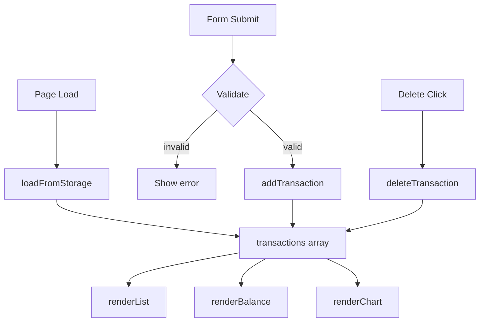

# Design Document: Vanilla Web App — Expense Tracker

## Overview

A fully client-side expense tracker delivered as a single HTML page with one CSS file and one JS file. No build step, no framework, no backend. All state lives in `localStorage`. The app lets users add and delete transactions, see a running balance, and view a pie chart of spending by category.

**Tech stack:**
- HTML5 (semantic markup)
- CSS3 (one file: `css/style.css`)
- Vanilla ES6+ JavaScript (one file: `js/app.js`)
- Chart.js via CDN for the pie chart
- `localStorage` for persistence

## Architecture

The app follows a simple unidirectional data flow:

```
User Action → State Mutation → localStorage Write → Re-render UI
```

All state is held in a single in-memory array (`transactions`) that is the source of truth. Every mutation (add/delete) writes the full array to `localStorage` and then re-renders the affected UI regions.



There is no routing, no component framework, and no module bundler. All functions are defined in `js/app.js` and operate on the shared `transactions` array.

## Components and Interfaces

### HTML Structure (`index.html`)

```
<body>
  <header>          — app title
  <section#balance> — total balance display
  <section#form>    — add-transaction form
  <section#list>    — scrollable transaction list
  <section#chart>   — pie chart or placeholder
</body>
```

### CSS (`css/style.css`)

Single stylesheet. Responsible for layout (flexbox/grid), form styling, list item styling, and the chart placeholder. No CSS variables required but recommended for the three category colors.

### JavaScript (`js/app.js`)

All logic lives here. Public surface (functions called from HTML event handlers or internally):

| Function | Signature | Purpose |
|---|---|---|
| `init` | `() → void` | Called on `DOMContentLoaded`; loads storage, renders all UI |
| `loadFromStorage` | `() → Transaction[]` | Reads and parses `localStorage`; returns array (empty on error) |
| `saveToStorage` | `(transactions: Transaction[]) → void` | Serializes and writes to `localStorage`; shows warning on error |
| `addTransaction` | `(name: string, amount: number, category: string) → void` | Validates, pushes to array, saves, re-renders |
| `deleteTransaction` | `(id: string) → void` | Filters array, saves, re-renders |
| `validateForm` | `(name: string, amount: string, category: string) → string \| null` | Returns error message or null if valid |
| `renderList` | `(transactions: Transaction[]) → void` | Rebuilds the `<ul>` in `#list` |
| `renderBalance` | `(transactions: Transaction[]) → void` | Updates the balance `<span>` |
| `renderChart` | `(transactions: Transaction[]) → void` | Updates or creates the Chart.js pie chart; shows placeholder when empty |
| `handleFormSubmit` | `(event: Event) → void` | Form `submit` listener; calls validate then addTransaction |
| `handleDeleteClick` | `(event: Event) → void` | Delegated click listener on `#list`; calls deleteTransaction |

### Chart.js Integration

A single `Chart` instance is created on first render and updated (`.data` mutation + `.update()`) on subsequent renders. The instance is stored in a module-level variable `let chartInstance = null`.

When `transactions` is empty, `chartInstance` is destroyed (if it exists) and a `<p class="chart-placeholder">` is shown instead.

## Data Models

### Transaction

```js
{
  id: string,        // crypto.randomUUID() or Date.now().toString()
  name: string,      // item name, non-empty
  amount: number,    // positive number (float allowed)
  category: string   // "Food" | "Transport" | "Fun"
}
```

### Storage Schema

Key: `"expense-tracker-transactions"`  
Value: JSON-serialized `Transaction[]`

```js
// Write
localStorage.setItem("expense-tracker-transactions", JSON.stringify(transactions));

// Read
JSON.parse(localStorage.getItem("expense-tracker-transactions") ?? "[]");
```

### Category Color Map

```js
const CATEGORY_COLORS = {
  Food:      "#FF6384",
  Transport: "#36A2EB",
  Fun:       "#FFCE56"
};
```

### Validation Rules

| Field | Rule |
|---|---|
| name | Non-empty after trim |
| amount | Parseable as float, result > 0 |
| category | One of "Food", "Transport", "Fun" |


## Correctness Properties

*A property is a characteristic or behavior that should hold true across all valid executions of a system — essentially, a formal statement about what the system should do. Properties serve as the bridge between human-readable specifications and machine-verifiable correctness guarantees.*

### Property 1: Valid transaction addition persists and appears

*For any* non-empty item name, positive numeric amount, and valid category, calling `addTransaction` should result in the transaction being present in `localStorage` and the rendered list length increasing by one.

**Validates: Requirements 1.2**

### Property 2: Empty field rejection

*For any* form submission where at least one field (name, amount, or category) is empty or whitespace-only, `validateForm` should return a non-null error string and no new transaction should be written to `localStorage`.

**Validates: Requirements 1.3**

### Property 3: Invalid amount rejection

*For any* amount value that is non-numeric, zero, or negative, `validateForm` should return a non-null error string and no new transaction should be written to `localStorage`.

**Validates: Requirements 1.4**

### Property 4: Balance equals sum of amounts

*For any* array of transactions, the value displayed as the balance should equal the arithmetic sum of all transaction `amount` fields (and equal 0 for an empty array).

**Validates: Requirements 4.1, 1.5, 3.2**

### Property 5: Transaction list renders all fields for all transactions

*For any* array of transactions, after `renderList` is called, every transaction's `name`, `amount`, and `category` should appear in the rendered list, and the number of rendered list items should equal the number of transactions.

**Validates: Requirements 2.1, 2.2**

### Property 6: Delete removes transaction from storage and list

*For any* transaction that exists in the transactions array, calling `deleteTransaction` with its `id` should result in that transaction no longer being present in `localStorage` and no longer appearing in the rendered list.

**Validates: Requirements 3.1**

### Property 7: Chart data matches per-category sums

*For any* non-empty array of transactions, the data passed to the Chart.js instance should contain exactly one entry per category present, with each entry's value equal to the sum of `amount` for all transactions in that category.

**Validates: Requirements 5.1**

### Property 8: Storage round-trip preserves transactions

*For any* array of `Transaction` objects, serializing to `localStorage` via `saveToStorage` and then reading back via `loadFromStorage` should produce an array that is deeply equal to the original.

**Validates: Requirements 6.1, 6.2**

---

*Edge cases covered by unit tests (not property tests):*
- *5.3*: When `transactions` is empty, the chart canvas is hidden and the placeholder `<p>` is visible.
- *6.3*: When `localStorage.setItem` throws, a warning message element becomes visible.

## Error Handling

| Scenario | Handling |
|---|---|
| `localStorage` unavailable / throws on write | `saveToStorage` catches the error and shows a `#storage-warning` element |
| `localStorage` returns invalid JSON on read | `loadFromStorage` catches `JSON.parse` error and returns `[]` |
| Form submitted with empty fields | `validateForm` returns an error string; error is shown in `#form-error`; no state mutation |
| Amount is non-numeric or ≤ 0 | Same as above |
| Delete called with unknown id | `filter` produces no change; no error thrown |
| Chart.js CDN fails to load | `renderChart` guards with `typeof Chart !== 'undefined'`; shows placeholder |

All errors are surfaced to the user via inline messages in the UI — no `alert()` or `console.error` as the primary feedback mechanism.

## Testing Strategy

Because this is a no-framework, no-build-tool project, tests are written as plain JavaScript using a lightweight property-based testing library loaded via CDN or npm (e.g., **fast-check** for property tests, **Jest** or plain `assert` for unit tests). Since the spec says "no test setup required", the testing strategy below describes what *should* be tested if a test harness is added.

### Unit Tests (specific examples and edge cases)

Focus on concrete scenarios and edge cases that property tests don't cover well:

- Form renders with correct fields and category options (Requirement 1.1)
- Empty transactions array shows chart placeholder, not canvas (Requirement 5.3)
- `localStorage` error triggers visible warning element (Requirement 6.3)
- `loadFromStorage` returns `[]` when key is absent
- `loadFromStorage` returns `[]` when stored value is malformed JSON

### Property-Based Tests

Use **fast-check** (or equivalent). Each test runs a minimum of **100 iterations**.

Each test is tagged with a comment in the format:
`// Feature: vanilla-web-app, Property N: <property text>`

**Property 1 — Valid transaction addition persists and appears**
```
// Feature: vanilla-web-app, Property 1: valid transaction addition persists and appears
fc.assert(fc.property(
  fc.string({ minLength: 1 }), fc.float({ min: 0.01 }), fc.constantFrom("Food","Transport","Fun"),
  (name, amount, category) => {
    addTransaction(name.trim() || "x", amount, category);
    const stored = loadFromStorage();
    return stored.some(t => t.name === name && t.amount === amount && t.category === category);
  }
), { numRuns: 100 });
```

**Property 2 — Empty field rejection**
```
// Feature: vanilla-web-app, Property 2: empty field rejection
// Generate inputs where at least one field is empty/whitespace
```

**Property 3 — Invalid amount rejection**
```
// Feature: vanilla-web-app, Property 3: invalid amount rejection
// Generate non-numeric strings and numbers <= 0
```

**Property 4 — Balance equals sum of amounts**
```
// Feature: vanilla-web-app, Property 4: balance equals sum of amounts
fc.assert(fc.property(
  fc.array(transactionArbitrary),
  (txns) => computeBalance(txns) === txns.reduce((s, t) => s + t.amount, 0)
), { numRuns: 100 });
```

**Property 5 — Transaction list renders all fields**
```
// Feature: vanilla-web-app, Property 5: transaction list renders all fields for all transactions
```

**Property 6 — Delete removes from storage and list**
```
// Feature: vanilla-web-app, Property 6: delete removes transaction from storage and list
fc.assert(fc.property(
  fc.array(transactionArbitrary, { minLength: 1 }),
  (txns) => {
    const target = txns[0];
    deleteTransaction(target.id);
    return !loadFromStorage().some(t => t.id === target.id);
  }
), { numRuns: 100 });
```

**Property 7 — Chart data matches per-category sums**
```
// Feature: vanilla-web-app, Property 7: chart data matches per-category sums
```

**Property 8 — Storage round-trip preserves transactions**
```
// Feature: vanilla-web-app, Property 8: storage round-trip preserves transactions
fc.assert(fc.property(
  fc.array(transactionArbitrary),
  (txns) => {
    saveToStorage(txns);
    return JSON.stringify(loadFromStorage()) === JSON.stringify(txns);
  }
), { numRuns: 100 });
```
